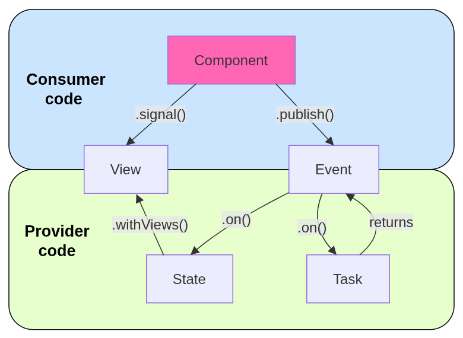

<div align="center">
  <h1>EVST</h1>
  <strong>Event, View, State, Task</strong><br />
  <strong>A minimalist, event-driven facade for NgRx Store.</strong>
</div>

<p align="center">
  <a href="https://github.com/fredyang/evst/actions/workflows/ci.yml">
    
  </a>
  <a href="https://www.npmjs.com/package/@evst/store">
    
  </a>
  <a href="https://www.npmjs.com/package/@evst/eslint-plugin">
    
  </a>
  <a href="LICENSE">
    
  </a>
</p>

- [What is EVST and why?](#what-is-evst-and-why)
- [Understanding the coding model](#understanding-the-coding-model)
- [Provider code](#provider-code)
  - [Modeling events](#modeling-events)
  - [Modeling State and Views](#modeling-state-and-views)
  - [Defining Tasks](#defining-tasks)
- [Consumer code](#consumer-code)
- [Registering state](#registering-state)
- [Enforcing event-driven code](#enforcing-event-driven-code)
- [Exploring the Books examples](#exploring-the-books-examples)
- [Working with NgRx](#working-with-ngrx)
- [Testing and developing](#testing-and-developing)
- [Developing the workspace](#developing-the-workspace)
- [Packaging](#packaging)

## What is EVST and why?

EVST is a minimalist, event-driven facade for NgRx Store. It organizes feature
code around four concepts: Event, View, State, and Task. It retains NgRx Store,
Effects, DevTools, and ecosystem compatibility.

NgRx is event-driven at its core, but its APIs also allow command-shaped
Actions that coordinate a particular response. EVST makes an event-driven style
explicit: events describe what happened, while State and Task decide how the
application responds.

NgRx provides Actions, reducers, selectors, and effects as separate APIs,
typically scattered across several files. That can make a feature harder to
navigate and its behavior harder to track. EVST encapsulates those APIs in four
concepts - Event, View, State, and Task - and organizes feature code more
cohesively with less boilerplate, without replacing NgRx.

## Understanding the coding model

The four EVST objects form the provider API. Components are consumer code and
interact only with Views and events.



| Object    | Role                                                                                  |
| --------- | ------------------------------------------------------------------------------------- |
| **Event** | Describes something that happened and is published by its source.                     |
| **View**  | Exposes read-only state to consumer code.                                             |
| **State** | Handles events through pure state transitions and provides Views.                     |
| **Task**  | Handles events, performs asynchronous or imperative work, and returns outcome events. |

The diagram separates EVST code into provider and consumer roles. Provider code
defines how State transitions in response to events, which Views expose state,
and how Tasks handle events and return outcome events. Consumer code reads Views
and publishes events.

## Provider code

### Modeling events

An event group is defined by its authoritative source. Its variable uses the
`fromSource` naming convention, such as `fromBooksPage` and `fromBooksApi`.
The name identifies where an event happened, not which State or Task handles
it, and discourages command-oriented names.

```ts
import { emptyProps, props } from "@ngrx/store";
import { events } from "@evst/store";

interface Book {
  id: string;
  title: string;
}

export const fromBooksPage = events("Books Page", {
  entered: emptyProps(),
  bookSelected: props<{ id: string }>(),
});

export const fromBooksApi = events("Books API", {
  loaded: props<{ books: Book[] }>(),
  loadFailed: props<{ message: string }>(),
});
```

An event key is a camelCase identifier, such as `bookSelected`. EVST derives the
readable NgRx type `[Books Page] Book Selected` while preserving the same
identifier at its definition and every use. Each event therefore remains
discoverable through standard IDE navigation and Find References. Each event creator
produces a standard NgRx Action, so events work with existing NgRx reducers,
effects, and DevTools.

### Modeling State and Views

`state()` infers the feature-state shape from its initial-state object and
automatically exposes a typed View for each top-level field. Optionally,
`.withViews()` composes additional derived Views from those default Views, while
`.on()` mirrors NgRx reducer `on()` semantics by adding pure event handlers.

```ts
import { state, view } from "@evst/store";
import { fromBooksApi, fromBooksPage } from "./books.events";

const initialState = {
  books: [] as Book[],
  selectedId: null as string | null,
  loading: false,
};

export const booksState = state("books", initialState)
  .withViews(({ books, selectedId }) => ({
    selectedBook: view(
      books,
      selectedId,
      (books, id) => books.find((book) => book.id === id) ?? null,
    ),
  }))
  .on(fromBooksPage.entered, (current) => ({
    ...current,
    loading: true,
  }))
  .on(fromBooksApi.loaded, (current, { books }) => ({
    ...current,
    books,
    loading: false,
  }))
  .on(fromBooksPage.bookSelected, (current, { id }) => ({
    ...current,
    selectedId: id,
  }));

export const booksViews = booksState.views;
```

### Defining Tasks

Tasks respond to events and return outcome events. Like State `.on()`, Task
`on()` pairs an event with its handler. It creates a functional NgRx Effect
with `createEffect()` and filters events for that handler.

```ts
import { HttpClient } from "@angular/common/http";
import { inject } from "@angular/core";
import { tasks } from "@evst/store";
import { catchError, exhaustMap, map, of } from "rxjs";
import { fromBooksApi, fromBooksPage } from "./books.events";

export const booksTasks = tasks((on) => ({
  load: on(fromBooksPage.entered, (pipe, http = inject(HttpClient)) => {
    return pipe(
      exhaustMap(() =>
        http.get<Book[]>("/api/books").pipe(
          map((books) => fromBooksApi.loaded({ books })),
          catchError(() =>
            of(fromBooksApi.loadFailed({ message: "Could not load books." })),
          ),
        ),
      ),
    );
  }),
}));
```

## Consumer code

Consumer code is about consuming Views and publishing events. It does not need
to know which State or Task reacts to an event, keeping it focused on what is
displayed and what happened.

```ts
import { Component, OnInit } from "@angular/core";
import { fromBooksPage } from "./books.events";
import { booksViews } from "./books.state";

@Component({
  selector: "app-books-page",
  template: `
    @if (loading()) {
      <p>Loading books…</p>
    }
    @for (book of books(); track book.id) {
      <button (click)="selectBook(book.id)">{{ book.title }}</button>
    }
  `,
})
export class BooksPageComponent implements OnInit {
  readonly books = booksViews.books.signal();
  readonly loading = booksViews.loading.signal();

  ngOnInit(): void {
    fromBooksPage.entered.publish();
  }

  selectBook(id: string): void {
    fromBooksPage.bookSelected.publish({ id });
  }
}
```

The component consumes the `books` and `loading` Views as Signals. It publishes
`fromBooksPage.entered` when the Books Page is entered and
`fromBooksPage.bookSelected` when a user selects a book. Those events belong to
the Books Page event source and are published by that source.

Views are consumed directly as Signals and events are published directly with
`.publish()`. The component does not need `store.select(...)` or
`store.dispatch(...)`.

Whether code is event-driven is determined by what it publishes and where it is
published. By contrast, a command-shaped Action describes work for a handler,
such as `loadBooks`, and can be dispatched by any caller that wants that work
performed.

An event has one publishing boundary: it is not published from several places.
An executable boundary also publishes only one event: events are not published
in sequence to coordinate work. Command-shaped Actions do not have these
constraints - a command may be dispatched by several callers or several
commands may be dispatched in sequence.

**Event-driven programming is a usage discipline, not a philosophical label.**
The `event-publisher-ownership` and `no-sequential-event-publishes` ESLint
rules enforce these constraints.

`.signal()` is the default for component rendering. Views also expose
`.observable()` for RxJS composition or template use with Angular's `AsyncPipe`:

```ts
readonly books$ = booksViews.books.observable();
```

```html
@if (books$ | async; as books) {
<!-- render books -->
}
```

Manual View subscriptions are normally unnecessary. Angular manages the
lifecycle of Signals and `AsyncPipe` subscriptions. Imperative integrations can
use a documented ESLint suppression with automatic teardown.

## Registering state

`provideEvst()` registers the root NgRx Store and EVST publishing support once.
State and Tasks can be registered separately or as one `bundle()`.

```ts
import { type ApplicationConfig } from "@angular/core";
import { provideEvst } from "@evst/store";

export const appConfig: ApplicationConfig = {
  providers: [provideEvst(), booksState.provide(), booksTasks.provide()],
};
```

```ts
import { bundle } from "@evst/store";

export const booksBundle = bundle(booksState, booksTasks);

export const appConfig: ApplicationConfig = {
  providers: [provideEvst(), booksBundle.provide()],
};
```

## Enforcing event-driven code

An API alone cannot ensure that events are used in an event-driven way.
`@evst/eslint-plugin` makes EVST's event-driven conventions enforceable and is
an important part of maintaining a high-quality EVST codebase:

- The preset requires event groups to use `fromSource` source-oriented names.
- An event has one publishing boundary.
- One executable boundary publishes one event.
- A State handles an event once.
- Unused events, Views, and Task subscriptions are reported.
- Component code prefers a View Signal or `AsyncPipe` over manual View
  subscriptions.

```ts
import evst from "@evst/eslint-plugin";
import tseslint from "typescript-eslint";

export default tseslint.config({
  files: ["src/**/*.ts"],
  plugins: { evst },
  ...evst.configs.evst,
});
```

Warnings can be suppressed for intentional exceptions. The EVST preset requires
a reason after `--` for Task-source and manual View-subscription suppressions.

## Exploring the Books examples

The [Books examples](example.md) provide a full, side-by-side demonstration of
EVST. Each application has identical UI and behavior, so the differences in
code are attributable to its Angular and state-management architecture.

[`ngrx-books`](examples/projects/ngrx-books) is the original NgRx example.
[`ngrx-books-standalone`](examples/projects/ngrx-books-standalone) retains the
same Store model with standalone components. [`evst-books`](examples/projects/evst-books)
uses EVST while retaining NgRx Store and Effects, making its reduced boilerplate
and consumer-facing View and event API directly comparable. A service-only
version provides an additional comparison.

## Working with NgRx

EVST is a facade over NgRx, not a replacement. Under the hood, it uses native
NgRx APIs to build its objects: event creators produce NgRx Actions, a View is
a callable memoized NgRx selector, State exposes a feature reducer, and a Task
collection exposes functional NgRx Effects.

EVST feature code is normally clearer when it uses Views and events rather than
mixing in direct Store APIs. The underlying NgRx objects remain compatible and
available when direct integration is needed. Entity adapters, router state,
meta-reducers, DevTools, and other standard NgRx APIs can still be used where
they fit the feature.

`provideEvst()` initializes an empty root reducer map and enables Redux DevTools
in Angular development mode. It accepts NgRx root Store configuration and
optional DevTools options:

```ts
provideEvst({
  runtimeChecks: { strictActionSerializability: true },
  devtools: { name: "Books" },
});
```

## Testing and developing

Each State exposes its generated reducer as `.reducer`, so state transitions can
be tested without an Angular injector or a Store:

```ts
import { expect, it } from "vitest";

it("selects a book", () => {
  const book = { id: "42", title: "The Hobbit" };
  const loaded = booksState.reducer(
    undefined,
    fromBooksApi.loaded({ books: [book] }),
  );
  const selected = booksState.reducer(
    loaded,
    fromBooksPage.bookSelected({ id: book.id }),
  );

  expect(selected.selectedId).toBe(book.id);
});
```

Task collections expose their generated functional Effects as `.effects`. They
can be invoked directly in a test injector with their dependencies replaced:

```ts
import { HttpClient } from "@angular/common/http";
import { TestBed } from "@angular/core/testing";
import { provideStore, Store } from "@ngrx/store";
import { expect, it } from "vitest";
import { firstValueFrom, of, take, type Observable } from "rxjs";

it("loads books", async () => {
  const book = { id: "42", title: "The Hobbit" };
  TestBed.configureTestingModule({
    providers: [
      provideStore(),
      booksTasks.provide(),
      { provide: HttpClient, useValue: { get: () => of([book]) } },
    ],
  });

  const result = TestBed.runInInjectionContext(() => {
    const load = booksTasks.effects.load as () => Observable<unknown>;
    return firstValueFrom(load().pipe(take(1)));
  });

  TestBed.inject(Store).dispatch(fromBooksPage.entered());

  await expect(result).resolves.toEqual(fromBooksApi.loaded({ books: [book] }));
});
```

From the repository root:

```sh
npm install
npm test --workspace @evst/store
npm pack --workspace @evst/store
```

The package requires compatible Angular and NgRx 22 dependencies, including
`@ngrx/store`, `@ngrx/effects`, and `@ngrx/store-devtools`.

Generate the API reference from JSDoc and TypeScript signatures:

```sh
npm run docs:api
```

The generated site is written to `packages/store/docs/api/index.html`.

## Developing the workspace

The root is a private npm workspace. Commands run from the repository root:

```sh
npm install
npm run build
npm test
```

The ESLint plugin can be tested independently:

```sh
npm test --workspace @evst/eslint-plugin
```

## Packaging

```sh
npm run pack:all
```

This creates installable archives for both packages. EVST is MIT-licensed; see
the [license](LICENSE). The [third-party notices](NOTICE) acknowledge the NgRx
Books examples.
