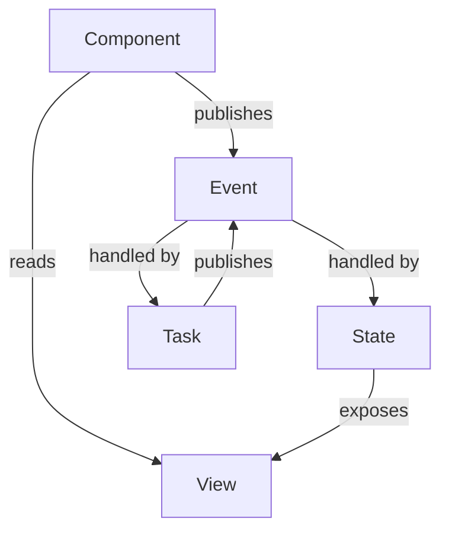

# NgRx Sugar

> **write less, do more**

This is the spirit of jQuery. Now NgRx Sugar bring it to NgRx Store.
We will have less to learn, less to remember, less to wire up.
Just four entry points to remember: `events`, `state`, `task`, and
`provideStoreSugar`, with a fluent API guiding the rest.

Defining state is fluent and discoverable. Starting with `state(...)`, editor
completion leads to `.on()`, `.withViews()`, `.withTasks()`, and `.provide()`.
Handlers, derived views, and registration fit together without remembering a
collection of separate setup functions.

This guide covers the common path rather than every option. The fluent API and
editor completion expose the available choices as a definition takes shape.

Consuming state is equally direct. Events expose `.publish()`; views expose
`.signal()` and `.observable()`. Components need no injected Store, `dispatch()`
calls, or selector wiring. NgRx's Store, reducers, memoized selectors, effects,
and DevTools still power the application underneath.

The API encourages an event-driven mindset: components describe **what happened**,
and state handlers and tasks decide how to respond. This discourages components
from issuing commands that coordinate the rest of the application.



The Store and reducer are intentionally absent from this model. It remains NgRx
infrastructure underneath; application code works with events, state, views,
and tasks instead.

## Defining events

This guide builds a small books page. Entering the page starts loading books;
selecting a book displays its title. Page interactions and API outcomes have
separate event sources.

```ts
// books.events.ts
import { emptyProps, props } from "@ngrx/store";
import { events } from "@ngrx-sugar/store";

export interface Book {
  id: string;
  title: string;
}

export const BooksPageEvents = events("Books Page", {
  entered: emptyProps(),
  bookSelected: props<{ id: string }>(),
});

export const BooksApiEvents = events("Books API", {
  booksLoaded: props<{ books: Book[] }>(),
  booksLoadFailed: props<{ message: string }>(),
});
```

`entered` reports a page interaction. The component does not need to know that
one listener sets a loading flag and another fetches books. More listeners can
react to that event without changing the component.

Calling a creator constructs a plain NgRx action. Publishing it is a separate
operation, shown in the component below.

```ts
BooksPageEvents.bookSelected({ id: "42" });
// { type: '[Books Page] Book Selected', id: '42' }
```

Event keys use camelCase; generated labels separate words and preserve acronyms.
Keys start with a lowercase ASCII letter and contain only ASCII letters and
digits. Payload creator functions are supported as well as `props()`.

## Defining state and views

`state()` starts with a feature name and initial values. `.on()` describes how
state responds to an event. `.withViews()` adds derived values using the views
already available on the definition.

```ts
// books.state.ts
import { loadBooks } from "./books.tasks";
import { state } from "@ngrx-sugar/store";
import { BooksApiEvents, BooksPageEvents, type Book } from "./books.events";

interface BooksState {
  books: Book[];
  selectedId: string | null;
  loading: boolean;
  error: string | null;
}

const initialState: BooksState = {
  books: [],
  selectedId: null,
  loading: false,
  error: null,
};

export const booksState = state("books", initialState)
  .on(BooksPageEvents.entered, (state) => ({
    ...state,
    loading: true,
    error: null,
  }))
  .on(BooksApiEvents.booksLoaded, (state, { books }) => ({
    ...state,
    books,
    loading: false,
  }))
  .on(BooksApiEvents.booksLoadFailed, (state, { message }) => ({
    ...state,
    loading: false,
    error: message,
  }))
  .on(BooksPageEvents.bookSelected, (state, { id }) => ({
    ...state,
    selectedId: id,
  }))
  .withViews(({ books, selectedId }, view) => ({
    selectedBook: view(
      books,
      selectedId,
      (books, id) => books.find((book) => book.id === id) ?? null,
    ),
  }))
  .withTasks([loadBooks]);
```

Every initialized state field gets a view automatically: `views.books`,
`views.loading`, and so on. `views.root` reads the whole feature state.
`views.selectedBook` is the derived view added above.

The supplied `view` builder uses NgRx's `createSelector`, with type inference
and memoization. `selectedBook` recalculates when `books` or `selectedId`
changes, and reuses its result when only `loading` or `error` changes. State
updates must remain immutable.

The chain needs no final `.build()` call. Each call returns a new definition,
preserving existing definitions and view identities. `.on()` also accepts
multiple event creators before a handler. Additional `.withViews()` calls
can compose earlier views; duplicate names and the reserved name `root` are
not allowed.

## Defining tasks

The same `entered` event that sets `loading` also triggers a request. The task
returns an API outcome event, which the state handles independently.

```ts
// books.tasks.ts
import { inject } from "@angular/core";
import { HttpClient } from "@angular/common/http";
import { Actions, ofType } from "@ngrx/effects";
import { task } from "@ngrx-sugar/store";
import { catchError, exhaustMap, map, of } from "rxjs";
import { BooksApiEvents, BooksPageEvents, type Book } from "./books.events";

export const loadBooks = task(
  (events$ = inject(Actions), http = inject(HttpClient)) =>
    events$.pipe(
      ofType(BooksPageEvents.entered),
      exhaustMap(() =>
        http.get<Book[]>("/api/books").pipe(
          map((books) => BooksApiEvents.booksLoaded({ books })),
          catchError(() =>
            of(
              BooksApiEvents.booksLoadFailed({
                message: "Books could not be loaded.",
              }),
            ),
          ),
        ),
      ),
    ),
);
```

The example expects `/api/books` to return a JSON array of books. `exhaustMap`
ignores repeated entries while a request is pending. Catching errors inside the
request keeps the task listening for future events.

NgRx dispatches events emitted by `task()` automatically. Tasks that only
perform work can use `{ dispatch: false }`. `task()` creates an NgRx observable
effect underneath; Angular's signal-based `effect()` is a separate API.

## Consuming events and views

The component reads views and announces interactions. It does not inject a Store
or coordinate the request and its state changes.

```ts
// books-page.component.ts
import { Component, type OnInit } from "@angular/core";
import { BooksPageEvents } from "./books.events";
import { booksState } from "./books.state";

@Component({
  selector: "app-books-page",
  template: `
    @if (loading()) {
      <p>Loading books…</p>
    }
    @if (error(); as message) {
      <p>{{ message }}</p>
    }
    @for (book of books(); track book.id) {
      <button (click)="selectBook(book.id)">{{ book.title }}</button>
    }
    @if (selectedBook(); as book) {
      <h2>Selected: {{ book.title }}</h2>
    }
  `,
})
export class BooksPageComponent implements OnInit {
  readonly books = booksState.views.books.signal();
  readonly loading = booksState.views.loading.signal();
  readonly error = booksState.views.error.signal();
  readonly selectedBook = booksState.views.selectedBook.signal();

  ngOnInit() {
    BooksPageEvents.entered.publish();
  }

  selectBook(id: string) {
    BooksPageEvents.bookSelected.publish({ id });
  }
}
```

Every view supports `.signal(options?)` and `.observable()`. RxJS consumers
can use a component field such as:

```ts
readonly books$ = booksState.views.books.observable();
```

View methods use the Store registered by `provideStoreSugar()`, so they work in
component fields, methods, and asynchronous callbacks. Observable subscriptions
may happen later. Views also remain usable as regular NgRx memoized selectors.

Event `.publish()` methods accept the same typed arguments as their creators.
After application initialization, they work in lifecycle hooks, event handlers,
and asynchronous callbacks without an injection context.

## Registering state

The application supplies the root Store once. A state definition attaches its
tasks and registers the feature through the same fluent API:

```ts
// app.config.ts
import { type ApplicationConfig } from "@angular/core";
import { provideHttpClient } from "@angular/common/http";
import { provideStoreSugar } from "@ngrx-sugar/store";
import { booksState } from "./books.state";

export const appConfig: ApplicationConfig = {
  providers: [provideHttpClient(), provideStoreSugar(), booksState.provide()],
};
```

`provideStoreSugar()` registers the root Store, enables publishing, and adds
Redux DevTools in Angular development mode. Separate `provideStore()` and
`provideStoreDevtools()` calls are unnecessary. Its options also accept NgRx
root Store configuration, such as `runtimeChecks` and `metaReducers`.

`booksState.provide()` registers the feature and the tasks attached with
`.withTasks([loadBooks])` in its definition. Feature
providers can live in route providers instead; `provideStoreSugar()` belongs
at the application root.

Standalone tasks expose their own `.provide()`. A task should be registered
once, either through its state or independently. `.withTasks()` accepts individual
functional tasks, task classes, named functional-task records, and arrays
combining these forms.

## Understanding registration and compatibility

NgRx Sugar reduces the public surface while retaining NgRx interoperability.
Events are NgRx actions, views are memoized selectors, and NgRx types such as
`Action` retain their original names. The package also exports `StateDefinition`,
`Task`, and `StoreSugarConfig` types.

`provideStoreSugar()` starts with an empty root reducer map. Features registered
through `.provide()` or NgRx's `provideState()` supply the state keys. DevTools
uses the default name `NgRx Sugar Store`; `devtools: false` disables it. Custom
options are forwarded without merging, and production mode skips registration.

Direct event publishing uses one active Store per loaded Sugar module. Module
federation can share the root Store and Sugar singleton while remotes register
features. Concurrent SSR applications or independent Stores require NgRx
providers and an injected Store for publishing and reading views. Destroying the
owning injector releases the publishing registration; a different active Store
is rejected.

The example keeps events, state, and tasks in separate modules without a
circular import. If state and task modules depend on each other, view access
must be deferred until the task runs; shared definitions in a separate module
can avoid the cycle.

## Testing

State transitions can be tested without an Angular injector or a Store:

```ts
import { expect, it } from "vitest";
import { booksState } from "./books.state";
import { BooksApiEvents, BooksPageEvents } from "./books.events";

it("selects a book after it is loaded", () => {
  const book = { id: "42", title: "The Hobbit" };
  const loaded = booksState.test.getNextState(
    undefined,
    BooksApiEvents.booksLoaded({ books: [book] }),
  );
  const selected = booksState.test.getNextState(
    loaded,
    BooksPageEvents.bookSelected({ id: book.id }),
  );

  expect(selected.selectedId).toBe(book.id);
  expect(
    booksState.views.selectedBook.projector(
      selected.books,
      selected.selectedId,
    ),
  ).toEqual(book);
});
```

`test` is intended for tests by convention. Tasks remain callable with explicit
dependencies, so tests can supply an event stream and an HTTP stub.

Component tests that publish events can register
`provideStoreSugar({ devtools: false })` before `provideMockStore(...)` in TestBed
providers. TestBed initialization captures the mock Store, and injector teardown
releases the registration.

## Installing and developing

The package requires compatible Angular and NgRx 22 dependencies, including
`@ngrx/store`, `@ngrx/effects`, and `@ngrx/store-devtools`. DevTools remains a
required peer dependency when disabled because the provider module imports it.

From the repository root:

```sh
npm install
npm test --workspace @ngrx-sugar/store
npm pack --workspace @ngrx-sugar/store
```

The test command builds the package, checks test types, and runs the unit tests.
The pack command produces an installable archive.
