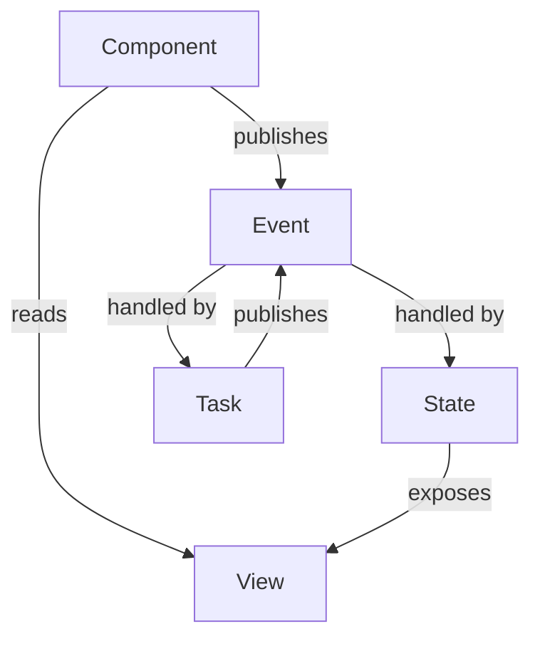

# NgRx-Eventify

table of content

1. why `'ngrx-entifiy`
2.

embed full source code url

## Why `ngrx-eventify`

I want to talk to about the intention of the this library

1. Fundermentially, NgRx has an event driven achitecture inside. It separate tranditonal
   object.method with action and handler. However, lots of adopter do not understand
   the power of this separation, continue to to use command driven mindset, and lots
   of ngrx project fail eventually fail the realize this important feature.

NgRx team clearly understand this,

> Actions are one of the main building blocks in NgRx. Actions express unique
> events that happen throughout your application. From user interaction with the
> page, external interaction through network requests, and direct interaction with
> device APIs, these and more events are described with actions.

However, they never stress this enough, that Treating Action as events is key of
the success of the NgRx project. NgRx does not force user to use event-driven style
to use NgRx. And most developer tend to model the action using command, and they
get it wrong at the first step.

This `ngrx-eventify` make event-first as the core value.

2. NgRx is techincal sound framework, it has loose API to to put things together, people call
   it boilterplate. Such as you need to create actions, reducer, selector, effects, register
   reducer, and effect as provider, ect. Although this has been greatly improved with
   function like createActionGroup, createFeature, but they feels like still not cohesive
   , and I feelt like it is ducktape.

   `ngrx-eventify` want to present them together in a more unified way, using fluet API. and
   hide some of the concept like store, selector, dispath.

### technical

`eventify` try to simplify object model as below



### providing state

1. state respond event with its handler (state transition function)
2. view readonly projection of state
3. taskCollection respond event with its handler task

### consuming state

1. component use view get readonly data from state
1. component publish events about what happened to itself

## typical workflow

### providing state

#### Modeling event

Event describe what happened to the publisher, publisher publish an event without who
is subscribe to the event, and how it is being handle.

It use the syntax

```ts
export const fromSource = events('Source', {
  eventName1: props<Type1>(),
  eventName2: props<Type2>(),
});

for example

export const fromBooksPage = events("Books Page", {
  entered: emptyProps(),
  bookSelected: props<{ id: string }>(),
});
```

#### define state

state holdes a stongly typed javascript json object.

It has three responsibility

1. expose view from consumer to read
2. subscribe events, which create a new state from the current state and event data

```ts
const xxxState = state(stateName, initialState);
.withViews(xxx)
```

#### define task collection

Task collection subscribe events with task funtion
We use similar syntax with state `on(xx, fn)`

```ts
const taskCollection = tasks((on) => ({
  doThis: on(fromXXx.event1, fn1),
  doThat: on(fromXXx.event1, fn1),
}));
```

### consuming state

```ts
export class BooksPageComponent implements OnInit {
  readonly books = booksState.views.books.signal();
  readonly loading = booksState.views.loading.signal();
  readonly error = booksState.views.error.signal();
  readonly selectedBook = booksState.views.selectedBook.signal();

  ngOnInit() {
    fromBooksPage.entered.publish();
  }

  selectBook(id: string) {
    fromBooksPage.bookSelected.publish({ id });
  }
}
```

### registering state

```ts
// bundle state with tasks and register together
state.withTasks(taskCllection);

provider: [state.provide()];

// or register state and taskCollection separately
provider: [state.provide(), taskCollection.provide()];
```

```ts
export const appConfig: ApplicationConfig = {
  providers: [
    // required
    provideStoreEventify({
      runtimeChecks: {
        strictStateSerializability: true,
        strictActionSerializability: true,
        strictActionWithinNgZone: false,
        strictActionTypeUniqueness: true,
      },
      devtools: { name: "NgRx Book Store App" },
    }),

    // provide state
    authState.provide(),
    coreState.provide(),
  ],
};
```

## use eslint to enforce event-driven programming
